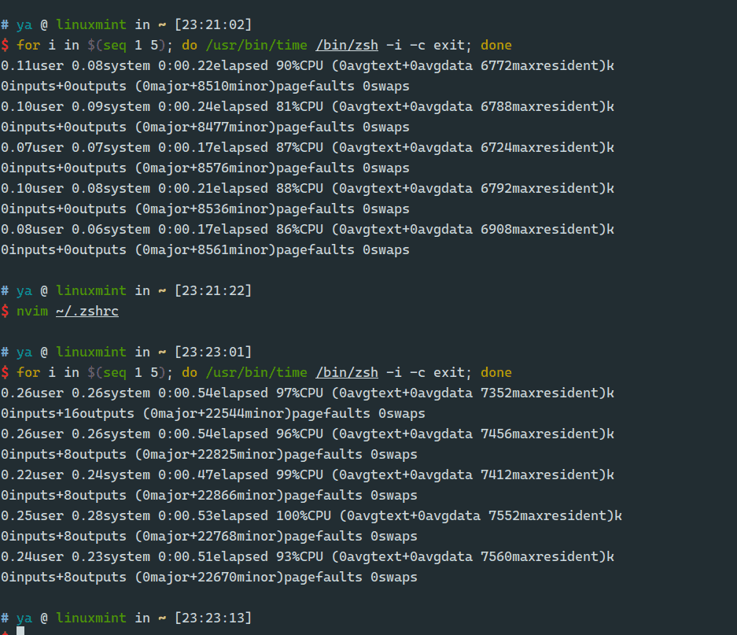

> 好久之前就使用的是zplug管理zsh插件，为了追求速度，打算使用zinit。

## 配置

我在zinit中多配置了一些插件，配置语法我目前也是一知半解，反正能用就行，我也不知道怎么更快，以后慢慢了解。

- zinit 配置

```zsh
# # ------------>>>    zinit    <<<-------------
### Added by Zinit's installer
if [[ ! -f $HOME/.local/share/zinit/zinit.git/zinit.zsh ]]; then
    print -P "%F{33} %F{220}Installing %F{33}ZDHARMA-CONTINUUM%F{220} Initiative Plugin Manager (%F{33}zdharma-continuum/zinit%F{220})…%f"
    command mkdir -p "$HOME/.local/share/zinit" && command chmod g-rwX "$HOME/.local/share/zinit"
    command git clone https://github.com/zdharma-continuum/zinit "$HOME/.local/share/zinit/zinit.git" && \
        print -P "%F{33} %F{34}Installation successful.%f%b" || \
        print -P "%F{160} The clone has failed.%f%b"
fi

source "$HOME/.local/share/zinit/zinit.git/zinit.zsh"
autoload -Uz _zinit
(( ${+_comps} )) && _comps[zinit]=_zinit

# Load a few important annexes, without Turbo (this is currently required for annexes)
zinit light-mode for \
    zdharma-continuum/zinit-annex-as-monitor \
    zdharma-continuum/zinit-annex-bin-gem-node \
    zdharma-continuum/zinit-annex-patch-dl \
    zdharma-continuum/zinit-annex-rust
# syntax highlight
zinit ice lucid wait='0'
zinit light zsh-users/zsh-syntax-highlighting
# auto-suggestion && completion
zinit ice lucid wait="0" atload='_zsh_autosuggest_start'
zinit light zsh-users/zsh-autosuggestions
zinit ice lucid blockf
zinit light zsh-users/zsh-completions
zinit ice lucid wait="0"
zinit light Aloxaf/fzf-tab
# OMZ
zinit ice lucid wait='1'
zinit snippet OMZ::plugins/git/git.plugin.zsh
zinit snippet OMZ::plugins/colored-man-pages/colored-man-pages.plugin.zsh
# Add `sudo` with <Esc><Esc>
zinit snippet OMZ::plugins/sudo/sudo.plugin.zsh
# theme
zinit snippet OMZ::lib/theme-and-appearance.zsh
zinit snippet OMZ::lib/git.zsh
zinit snippet OMZ::lib/async_prompt.zsh
zinit snippet OMZ::plugins/svn/svn.plugin.zsh
zinit snippet OMZ::themes/ys.zsh-theme
#
### End of Zinit's installer chunk
```

- zplug 配置

```zsh
# ------------>>>    zplug    <<<-------------
if [[ ! -d ~/.zplug ]];then
  git clone https://github.com/b4b4r07/zplug.git ~/.zplug
  source ~/.zplug/zplug
  zplug update --self
fi
source ~/.zplug/init.zsh

zplug "plugins/svn", from:oh-my-zsh
zplug "themes/ys", from:oh-my-zsh

zplug "lib/history", from:oh-my-zsh
zplug "zsh-users/zsh-completions"
zplug "zsh-users/zsh-autosuggestions", as:plugin
zplug "zsh-users/zsh-syntax-highlighting", as:plugin, defer:2
zplug "zsh-users/zsh-history-substring-search", as:plugin, defer:3

# Install plugins if there are plugins that have not been installed
if ! zplug check --verbose; then
    printf "Install zplug plugins? [y/N]: "
    if read -q; then
        echo; zplug install
    fi
fi

zplug load
```

## 对比



对比发现，zinit虽然加载了更多插件，但启动速度稳定在0.2秒左右，而zplug则在0.5秒左右。
